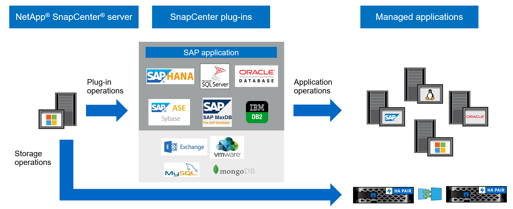

= 概述SnapCenter
:allow-uri-read: 
:icons: font
:imagesdir: ../media/

[role="lead"]
SnapCenter 軟體是一個簡單，集中且可擴充的平台，可為混合雲中 ONTAP 系統上的應用程式，資料庫，主機檔案系統和 VM 提供應用程式一致的資料保護。

利用NetApp Snapshot、功能豐富、FlexClone、SnapMirror和支援技術、提供下列功能：SnapCenter SnapRestore SnapVault

* 快速、節省空間、應用程式一致的磁碟型備份
* 快速、精細的還原、以及應用程式一致的還原
* 快速、節省空間的複製

包含不支援的伺服器和個別輕量外掛程式。SnapCenter SnapCenter您可以將外掛程式部署自動化至遠端應用程式主機，排程備份，驗證及複製作業，以及監控所有資料保護作業。

SnapCenter 可以安裝在內部部署或公有雲上，以保護資料。

* 內部部署以保護下列項目：
+
** ONTAP FAS ， AFF 或 ASA 主要系統上的資料，並複寫至 ONTAP FAS ， AFF 或 ASA 次要系統
** 資料位於不整系統上ONTAP Select
** 位於 ONTAP FAS 、 AFF 或 ASA 主要和次要系統上、並受本機 StorageGRID 物件儲存保護的資料
** ONTAP ASA R2 主要和次要系統上的資料

* 內部部署於混合雲中、以保護下列項目：
+
** ONTAP FAS 、 AFF 或 ASA 主要系統上的資料、並複寫至 Cloud Volumes ONTAP
** 位於 ONTAP FAS 、 AFF 或 ASA 主要和次要系統上、並受雲端物件和歸檔儲存保護的資料（使用 BlueXP 備份和還原整合）

* 在公有雲中保護下列項目：
+
** 資料位於Cloud Volumes ONTAP 僅有ONTAP 的部分系統（前身為《不知道如何解決此問題》）
** Amazon FSX ONTAP 上的資料以供支援
** 位於主要 Azure NetApp Files （ Oracle 、 Microsoft SQL 和 SAP HANA ）上的資料

== 主要功能

SnapCenter 提供下列主要功能：

* 集中化，應用程式一致的資料保護功能，可保護不同的應用程式
+
Microsoft Exchange Server ， Microsoft SQL Server ， Linux 或 AIX 上的 Oracle 資料庫， SAP HANA 資料庫， IBM DB2 ， PostgreSQL ， MySQL 和 ONTAP 系統上執行的 Windows 主機檔案系統均支援資料保護。

+
其他標準或自訂應用程式和資料庫也支援資料保護、提供架構以建立使用者定義SnapCenter 的功能表外掛程式。如此一來、其他應用程式和資料庫就能從同一個單一窗口進行資料保護。藉由運用此架構， NetApp 已發行適用於 MongoDB ， Storage ， MaxDB ， Sybase ASE ， ORASCPM 的 SnapCenter 外掛程式。您也可以使用開發人員指南建立自己的外掛程式。

* 原則型備份
+
原則型備份利用 NetApp Snapshot 技術來建立快速、節省空間、應用程式一致、磁碟型的備份。或者、您也可以更新現有的保護關係、將這些備份作業自動化至二線儲存設備。

* 備份多種資源
+
您可以使用SnapCenter 資源群組、同時備份同類型的多個資源（應用程式、資料庫或主機檔案系統）。

* 還原與還原
+
提供快速、精細的備份還原、以及應用程式一致、以時間為基礎的還原。SnapCenter您可以從混合雲中的任何目的地還原。

* 複製
+
提供快速、節省空間、應用程式一致的複製功能、可加速軟體開發。SnapCenter您可以在混合雲中的任何目的地上複製。

* 單一使用者管理圖形化使用者介面（GUI）
+
SnapCenter 提供一個 GUI ，是單一的一站式介面，用於管理混合雲中任何目的地的資源備份和複本。

* REST API、Windows Cmdlet、UNIX命令
+
SnapCenter 提供 REST API ，可用於大多數功能，以整合任何協調軟體，以及使用 Windows PowerShell Cmdlet 和命令列介面。

* 集中式資料保護儀表板與報告
* 以角色為基礎的存取控制（ RBAC ），提供安全性與委派功能
* 內建儲存庫資料庫，具備高可用度，可儲存所有備份中繼資料
* 自動化外掛程式的推送安裝
* 高可用度
* 災難恢復（DR）
* SnapLock https://docs.netapp.com/us-en/ontap/snaplock/["深入瞭解"]
* SnapMirror 主動同步（最初以 SnapMirror 業務連續性 [SM-BC] 形式發佈）
* 同步鏡射 https://docs.netapp.com/us-en/e-series-santricity/sm-mirroring/overview-mirroring-sync.html["深入瞭解"]

== SnapCenter 架構與元件

SnapCenter 平台是以多層架構為基礎，其中包含集中式管理伺服器和外掛式主機。支援多站台資料中心。SnapCenterSnapCenter 伺服器主機和外掛主機可以位於不同的地理位置。

SnapCenter 包括 SnapCenter 伺服器，適用於 Windows 的 SnapCenter 外掛程式套件，以及適用於 Linux 的 SnapCenter 外掛程式套件。每個套件都包含適用於各種應用程式和基礎架構元件的外掛程式。

=== 伺服器SnapCenter

SnapCenter 伺服器支援 Microsoft Windows 和 Linux （ RHEL 8.x ， RHEL 9.x ， SLES 15 SP5 ）作業系統。SnapCenter 伺服器包含 Web 伺服器，集中式 HTML5 使用者介面， PowerShell Cmdlet ， REST API 及 SnapCenter 儲存庫。

支援使用HTTPS的支援伺服器和外掛程式與主機代理程式通訊。SnapCenter關於功能的資訊SnapCenter 會儲存在SnapCenter 資訊庫中。

=== 實體外掛程式SnapCenter

每SnapCenter 個支援特定環境、資料庫和應用程式的支援。

|===
| 外掛程式名稱 | 包含在安裝套件中 | 需要其他外掛程式 | 安裝在主機上 | 平台支援 

 a| 
適用於 Microsoft SQL Server 的 SnapCenter 外掛程式
 a| 
適用於 Windows 的外掛程式套件
 a| 
適用於Windows的外掛程式
 a| 
SQL Server主機
 a| 
Windows

 a| 
適用於 Windows 的 SnapCenter 外掛程式
 a| 
適用於 Windows 的外掛程式套件
 a| 
 a| 
Windows主機
 a| 
Windows

 a| 
適用於 Microsoft Exchange Server 的 SnapCenter 外掛程式
 a| 
適用於 Windows 的外掛程式套件
 a| 
適用於Windows的外掛程式
 a| 
Exchange Server主機
 a| 
Windows

 a| 
適用於 Oracle 資料庫的 SnapCenter 外掛程式
 a| 
適用於 Linux 的外掛程式套件，以及適用於 AIX 的外掛程式套件
 a| 
UNIX外掛程式
 a| 
Oracle主機
 a| 
Linux或AIX

 a| 
適用於 SAP HANA 資料庫的 SnapCenter 外掛程式
 a| 
適用於 Linux 的外掛程式套件，以及適用於 Windows 的外掛程式套件
 a| 
適用於 UNIX 的外掛程式或適用於 Windows 的外掛程式
 a| 
HDBSQL用戶端主機
 a| 
Linux或Windows

 a| 
不適用的自訂外掛程式SnapCenter
 a| 
適用於 Linux 的外掛程式套件，以及適用於 Windows 的外掛程式套件
 a| 
若要進行檔案系統備份，請使用適用於 Windows 的外掛程式
 a| 
自訂應用程式主機
 a| 
Linux或Windows

 a| 
適用於 IBM DB2 的 SnapCenter 外掛程式
 a| 
適用於 Linux 的外掛程式套件，以及適用於 Windows 的外掛程式套件
 a| 
適用於 UNIX 的外掛程式或適用於 Windows 的外掛程式
 a| 
DB2 主機
 a| 
Linux ， AIX 或 Windows

 a| 
適用於 PostgreSQL 的 SnapCenter 外掛程式
 a| 
適用於 Linux 的外掛程式套件，以及適用於 Windows 的外掛程式套件
 a| 
適用於 UNIX 的外掛程式或適用於 Windows 的外掛程式
 a| 
PostgreSQL 主機
 a| 
Linux或Windows

 a| 
適用於 MySQL 的 SnaoCenter 外掛程式
 a| 
適用於 Linux 的外掛程式套件，以及適用於 Windows 的外掛程式套件
 a| 
適用於UNIX的外掛程式或適用於Windows的外掛程式
 a| 
MySQL 主機
 a| 
Linux或Windows

 a| 
SnapCenter 外掛程式，適用於 MongoDB
 a| 
適用於 Linux 的外掛程式套件，以及適用於 Windows 的外掛程式套件
 a| 
適用於 UNIX 的外掛程式或適用於 Windows 的外掛程式
 a| 
MongoDB 主機
 a| 
Linux或Windows

 a| 
適用於 ORASCPM （ Oracle 應用程式）的 SnapCenter 外掛程式
 a| 
適用於 Linux 的外掛程式套件，以及適用於 Windows 的外掛程式套件
 a| 
適用於 UNIX 的外掛程式或適用於 Windows 的外掛程式
 a| 
Oracle主機
 a| 
Linux或Windows

 a| 
適用於 SAP ASE 的 SnapCenter 外掛程式
 a| 
適用於 Linux 的外掛程式套件，以及適用於 Windows 的外掛程式套件
 a| 
適用於 UNIX 的外掛程式或適用於 Windows 的外掛程式
 a| 
SAP 主機
 a| 
Linux或Windows

 a| 
SnapCenter 外掛程式，適用於 SAP MaxDB
 a| 
適用於 Linux 的外掛程式套件，以及適用於 Windows 的外掛程式套件
 a| 
適用於 UNIX 的外掛程式或適用於 Windows 的外掛程式
 a| 
SAP MaxDB 主機
 a| 
Linux或Windows

 a| 
儲存外掛程式的 SnapCenter 外掛程式
 a| 
適用於 Linux 的外掛程式套件，以及適用於 Windows 的外掛程式套件
 a| 
適用於 UNIX 的外掛程式或適用於 Windows 的外掛程式
 a| 
儲存主機
 a| 
Linux或Windows

|===
VMware vSphere的支援VMware vSphere的VMware vCenter外掛程式可支援虛擬機器（VM）、資料存放區和虛擬機器磁碟（VMDK）的損毀一致與VM一致的備份與還原作業、並支援以應用程式為特定的外掛程式、以保護虛擬化資料庫和檔案系統的應用程式一致備份與還原作業。SnapCenter SnapCenter

如果您的資料庫或檔案系統儲存在 VM 上，或者您想要保護 VM 和資料存放區，則必須部署適用於 VMware vSphere 虛擬應用裝置的 SnapCenter 外掛程式。如需相關資訊、請參閱 https://docs.netapp.com/us-en/sc-plugin-vmware-vsphere/index.html["VMware vSphere文件的VMware外掛程式SnapCenter"^]。

=== 系統儲存庫SnapCenter

此系統庫有時也稱為NSM資料庫、可儲存每個環節的資訊和中繼資料。SnapCenter SnapCenter

MySQL Server儲存庫資料庫預設會在您安裝SnapCenter 此伺服器時安裝。如果已經安裝MySQL Server、而且您正在執行SnapCenter 全新安裝的功能、則應該解除安裝MySQL Server。

支援MySQL Server 8.0.37或更新版本作為不支援的儲存庫資料庫。SnapCenter SnapCenter如果您使用舊版的MySQL Server搭配舊版SnapCenter 的功能、SnapCenter 在進行更新時、MySQL Server會升級至8.0.37或更新版本。

此產品庫儲存下列資訊和中繼資料：SnapCenter

* 備份、複製、還原及驗證中繼資料
* 報告、工作和事件資訊
* 主機與外掛程式資訊
* 角色、使用者及權限詳細資料
* 儲存系統連線資訊

