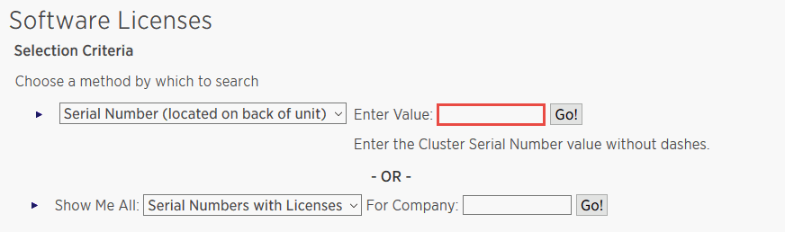

= 新增SnapCenter 以控制器為基礎的功能
:allow-uri-read: 
:icons: font
:imagesdir: ../media/

[role="lead"]
如果您使用的是 FAS 、 AFF 或所有 SAN 陣列（ ASA ）儲存控制器、則需要 SnapCenter 標準控制器型授權。

控制器型授權具有下列特性：

* 隨附於購買Premium或Flash產品組合的標準授權（不含基礎套件）SnapCenter
* 無限使用儲存設備
* 可透過 ONTAP 系統管理員或儲存叢集命令列、將其直接新增至 FAS 、 AFF 或 ASA 儲存控制器
+

NOTE: 您不需要在SnapCenter 「介紹GUI」中輸入SnapCenter 任何授權資訊、以取得以控制器為基礎的授權。

* 鎖定至控制器的序號

如需所需授權的相關資訊、請參閱 link:../install/concept_snapcenter_licenses.html["不需要授權SnapCenter"^]。

== 步驟 1 ：確認是否已安裝 SnapManager 套件授權

您可以使用 SnapCenter GUI 來檢視 SnapManager 套件授權是安裝在 FAS 、 AFF 或 ASA 主儲存系統上、並識別哪些儲存系統可能需要 SnapManager 套件授權。SnapManager 套件授權僅適用於主要儲存系統上的 FAS 、 AFF 和 ASA SVM 或叢集。

NOTE: 如果SnapManager 您的控制器上已經有一個用作支援的版本、SnapCenter 則會自動提供以支援控制器為基礎的支援服務。SnapManagerSuite授權和SnapCenter 以控制器為基礎的SESS-授權名稱可互換使用、但它們指的是相同的授權。

.步驟
. 在左導覽窗格中、選取 * 儲存系統 * 。
. 在「儲存系統」頁面的「*類型*」下拉式清單中、選取是否要檢視所有新增的SVM或叢集：
+
** 若要檢視所有新增的SVM、請選取* ONTAP 《SVMS*》。
** 若要檢視所有已新增的叢集、請選取* ONTAP 《叢集》*。
+
當您選取叢集名稱時、屬於叢集一部分的所有 SVM 都會顯示在儲存虛擬機器區段中。

. 在Storage Connections（儲存連線）清單中、找到Controller License（控制器授權）欄。
+
「Controller License」（控制器授權）欄會顯示下列狀態：

+
** image:../media/controller_licensed_icon.gif["核取圖示"] 表示 SnapManager 套件授權已安裝在 FAS 、 AFF 或 ASA 主儲存系統上。
** image:../media/controller_not_licensed_icon.gif["取消圖示"] 表示 SnapManager 套件授權未安裝在 FAS 、 AFF 或 ASA 主儲存系統上。
** 不適用表示 SnapManager 套件授權不適用、因為儲存控制器位於 Amazon FSX for NetApp ONTAP 、 Cloud Volumes ONTAP 、 ONTAP Select 或次要儲存平台上。

== 步驟 2 ：識別安裝在控制器上的授權

您可以使用ONTAP 效益指令列來檢視控制器上安裝的所有授權。您應該是 FAS 、 AFF 或 ASA 系統上的叢集管理員。

NOTE: 以控制器為基礎的「以程式控制器為基礎」授權會顯示為SnapManagerSuite授權。SnapCenter

.步驟
. 使用ONTAP flexfline命令列登入NetApp控制器。
. 輸入license show命令、然後檢視輸出以判斷是否已安裝SnapManagerSuite授權。
+
.輸出範例
[%collapsible]
====
[listing]
----
cluster1::> license show
(system license show)

Serial Number: 1-80-0000xx
Owner: cluster1
Package           Type     Description              Expiration
----------------- -------- ---------------------    ---------------
Base              site     Cluster Base License     -

Serial Number: 1-81-000000000000000000000000xx
Owner: cluster1-01
Package           Type     Description              Expiration
----------------- -------- ---------------------    ---------------
NFS               license  NFS License              -
CIFS              license  CIFS License             -
iSCSI             license  iSCSI License            -
FCP               license  FCP License              -
SnapRestore       license  SnapRestore License      -
SnapMirror        license  SnapMirror License       -
FlexClone         license  FlexClone License        -
SnapVault         license  SnapVault License        -
SnapManagerSuite  license  SnapManagerSuite License -
----
====
+
在此範例中、SnapManagerSuite授權已安裝、因此不SnapCenter 需要執行其他的功能驗證動作。

== 步驟 3 ：擷取控制器序號

您需要有控制器序號、才能擷取控制器型授權的序號。您可以使用ONTAP 下列命令列擷取控制器序號：您應該是 FAS 、 AFF 或 ASA 系統上的叢集管理員。

.步驟
. 使用ONTAP flexfline命令列登入控制器。
. 輸入system show -instance命令、然後檢閱輸出以找出控制器序號。
+
.輸出範例
[%collapsible]
====
[listing]
----
cluster1::> system show -instance

Node: fasxxxx-xx-xx-xx
Owner:
Location: RTP 1.5
Model: FAS8080
Serial Number: 123451234511
Asset Tag: -
Uptime: 143 days 23:46
NVRAM System ID: xxxxxxxxx
System ID: xxxxxxxxxx
Vendor: NetApp
Health: true
Eligibility: true
Differentiated Services: false
All-Flash Optimized: false

Node: fas8080-41-42-02
Owner:
Location: RTP 1.5
Model: FAS8080
Serial Number: 123451234512
Asset Tag: -
Uptime: 144 days 00:08
NVRAM System ID: xxxxxxxxx
System ID: xxxxxxxxxx
Vendor: NetApp
Health: true
Eligibility: true
Differentiated Services: false
All-Flash Optimized: false
2 entries were displayed.
----
====
. 記錄序號。

== 步驟 4 ：擷取控制器型授權的序號

如果您使用FAS 的是功能不全或AFF 功能不全的儲存設備、您可以先SnapCenter 從NetApp支援網站擷取以支援控制器為基礎的授權、然後再使用ONTAP 功能不全的命令列進行安裝。

.開始之前
* 您應該擁有有效的NetApp支援網站登入認證資料。
+
如果您未輸入有效的認證資料、則不會傳回任何資訊供您搜尋。

* 您應該有控制器序號。

.步驟
. 登入 http://mysupport.netapp.com/["NetApp 支援網站"^]。
. 瀏覽至* Systems *>* Software Licenses*。
. 在「選擇條件」區域中、確認已選取序號（位於裝置背面）、輸入控制器序號、然後選取「 *Go!* 」。
+

+
隨即顯示指定控制器的授權清單。

. 找出SnapCenter 並記錄《不實的標準版」或SnapManagerSuite授權。

== 步驟 5 ：新增控制器型授權

當您使用 FAS 、 AFF 或 ASA 系統、並且擁有 SnapCenter Standard 或 SnapManagerSuite 授權時、您可以使用 ONTAP 命令列來新增 SnapCenter 控制器型授權。

.開始之前
* 您應該是 FAS 、 AFF 或 ASA 系統上的叢集管理員。
* 您應該擁有SnapCenter 「不含任何功能的標準版」或「SnapManagerSuite」授權。

.關於這項工作
如果您想要試用 FAS 、 AFF 或 ASA 儲存設備來安裝 SnapCenter 、您可以取得優質產品組合評估授權、以便在控制器上安裝。

如果您想SnapCenter 要試用版安裝、請聯絡您的銷售代表、以取得Premium產品組合評估授權、以便安裝在您的控制器上。

.步驟
. 使用ONTAP flexfline命令列登入NetApp叢集。
. 新增SnapManagerSuite授權金鑰：
+
「系統授權新增-授權碼license_key」

+
此命令可在管理權限層級使用。

. 確認SnapManagerSuite授權已安裝：
+
《許可證展示》

== 步驟 6 ：移除試用授權

如果您使用的SnapCenter 是以控制器為基礎的VMware認證、而且需要移除容量型試用授權（以「50」結尾的序號）、您應該使用MySQL命令手動移除試用版授權。試用版授權無法使用SnapCenter VMware GUI刪除。

NOTE: 只有在使用SnapCenter 以VMware控制器為基礎的授權時、才需要手動移除試用授權。

.步驟
. 在伺服SnapCenter 器上、開啟PowerShell視窗以重設MySQL密碼。
+
.. 執行Open-SmConnection Cmdlet、針對SnapCenter SnapCenterAdmin帳戶、啟動與該伺服器的連線工作階段。
.. 執行Set-SmRegitoryPassword以重設MySQL密碼。
+
如需 Cmdlet 的相關資訊，請參閱 https://library.netapp.com/ecm/ecm_download_file/ECMLP2886205["《軟件指令程式參考指南》SnapCenter"^]。

. 開啟命令提示字元並執行mySQL -u root -p以登入MySQL。
+
MySQL會提示您輸入密碼。輸入您在重設密碼時提供的認證資料。

. 從資料庫移除試用授權：
+
「使用NSM、'Delete from NSM_License、其中NSM_License_Serial_number='510000050'；」

