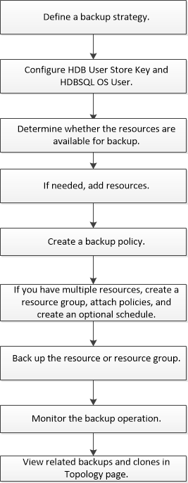

= 備份SAP HANA資源
:allow-uri-read: 
:icons: font
:imagesdir: ../media/

[role="lead"]
您可以建立資源（資料庫）或資源群組的備份。備份工作流程包括規劃、識別備份資料庫、管理備份原則、建立資源群組及附加原則、建立備份及監控作業。

下列工作流程顯示您必須執行備份作業的順序：

您也可以手動或在指令碼中使用 PowerShell Cmdlet 來執行備份、還原及複製作業。Cmdlet說明及Cmdlet參考資訊包含更多PowerShell Cmdlet的相關資訊。SnapCenter
https://library.netapp.com/ecm/ecm_download_file/ECMLP2886205["《軟件指令程式參考指南》SnapCenter"^]。
