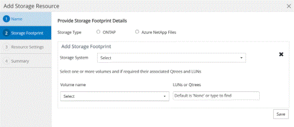

= 將資源新增至 NetApp 支援的外掛程式
:allow-uri-read: 
:icons: font
:imagesdir: ../media/

[role="lead"]
您必須新增要備份或複製的資源。視您的環境而定、資源可能是您要備份或複製的資料庫執行個體或集合。

.開始之前
* 您必須已完成安裝SnapCenter 完「支援服務器」、新增主機、建立儲存系統連線、以及新增認證等工作。
* 您必須已將外掛程式上傳至SnapCenter 更新伺服器。

.步驟
. 在左側導覽窗格中、選取 * 資源 * 、然後從清單中選取適當的外掛程式。
. 在「資源」頁面中、選取 * 新增資源 * 。
. 在「提供資源詳細資料」頁面中、執行下列動作：
+
|===
| 針對此欄位... | 執行此動作... 

 a| 
名稱
 a| 
輸入資源名稱。

 a| 
主機名稱
 a| 
選取主機。

 a| 
類型
 a| 
選取類型。類型是根據外掛程式說明檔案所定義的使用者定義。例如、資料庫和執行個體。

如果選取的類型有父項目、請輸入父項目的詳細資料。例如、如果類型是「資料庫」、而父類型是「執行個體」、請輸入執行個體的詳細資料。

 a| 
認證名稱
 a| 
選取「認證」或建立新的認證資料。

 a| 
掛載路徑
 a| 
輸入掛載資源的掛載路徑。這僅適用於Windows主機。

|===
. 在「提供儲存空間」頁面中、選取儲存系統、然後選擇一或多個磁碟區、 LUN 和 qtree 、然後選取 * 儲存 * 。
+
選用：選取 image:../media/add_policy_from_resourcegroup.gif["加號圖示"] 圖示、可從其他儲存系統新增更多磁碟區、LUN及qtree。

+

NOTE: NetApp 支援的外掛程式不支援自動探索資源。實體與虛擬環境的儲存詳細資料也不會自動探索。您必須在建立資源的同時、提供實體和虛擬環境的儲存資訊。

+

. 在「資源設定」頁面中、提供資源的自訂金鑰值配對。
+

NOTE: 確定自訂金鑰名稱為大寫。

+
image::../media/resource_settings.gif[資源設定]

+
如需個別外掛程式參數的相關資訊、請參閱 link:add_resources_to_netapp_supported_plugins.html#parameters-to-configure-the-resource["設定資源的參數"]

. 檢閱摘要、然後選取 * 完成 * 。

.結果
這些資源會連同類型、主機或叢集名稱、相關資源群組和原則、以及整體狀態等資訊一起顯示。

IMPORTANT: 如果資料庫重新命名為SnapCenter 不屬於支援範圍、您必須重新整理資源。

.完成後
如果您想讓其他使用者存取資產、SnapCenter 則該管理員必須將資產指派給這些使用者。如此一來、使用者就能對指派給他們的資產執行其擁有權限的動作。

新增資源之後、您可以修改資源詳細資料。如果 NetApp 支援的外掛程式資源有相關的備份、則無法修改下列欄位：資源名稱、資源類型和主機名稱。

== 設定資源的參數

如果您是手動新增外掛程式、您可以使用下列參數、在「資源設定」頁面中設定資源。

=== MongoDB 外掛程式

資源設定：

* MongoDB_APP_SERVER= （資源類型為共享叢集）或 MongoDB_ReplicicaSet_Server= （資源類型為複製集）
* OPLOG_PATH = （如果是從 MongoDB.propertiesfile 提供的選用參數、則為選用參數）
* MongoDB_Authentication_type= （ LDAP 驗證為純文字、其他則為無）

您必須在 MongoDB.properties 檔案中提供下列參數：

* disable_Starting 停止服務 =
+
** n 如果啟動 / 停止服務是由外掛程式執行。
** Y 、如果使用者執行 start/** 停止服務。
** 選用參數的預設值設為 N

* OPLOG_path_= （如果 SnapCenter 中已提供自訂金鑰值配對、則為選用參數）。

=== 適用於 MaxDB 的外掛程式

資源設定：

* XUSER_enable （ Y|N ）可啟用或停用 MaxDB 的 xuser 、因此資料庫使用者不需要密碼。
* Handl_LOGWRITER （ Y|N ）執行暫停記錄寫入器（ N ）或恢復記錄寫入器（ Y ）作業。
* DBMCLICMD （ path_to_dbmcli_cmd ）會指定 MaxDB dbmCLI 命令的路徑。如果未設定、則會使用搜尋路徑上的 dbmcli.

NOTE: 對於 Windows 環境、路徑必須在雙引號（ "..." ）內。

* SQLCLICMD （ path_to_sqlcli_cmd ）指定 MaxDB sqlclib 命令的路徑。如果未設定路徑、則會在搜尋路徑上使用 sqlcli.
* MaxDB_update_HIST_LOG （ Y|N ）會指示 MaxDB 備份程式是否應更新 MaxDB 記錄。
* MaxDB_check 快照 _DIR ：範例、 SID1 ：目錄 [ 、目錄 ... ] ； [SID2 ：目錄 [ 、目錄 ... ] 檢查 Snap Creator Snapshot 複本作業是否成功、並確保建立快照。
+
這僅適用於NFS。目錄必須指向包含.snapshot目錄的位置。多個目錄可以包含在以逗號分隔的清單中。

+
在MaxDB 7.8及更新版本中、資料庫備份要求在備份記錄中會標示為「失敗」。

* MaxDB_backup_templates ：指定每個資料庫的備份範本。
+
範本必須存在且為外部備份範本類型。若要啟用 MaxDB 7.8 及更新版本的快照整合、您必須具備 MaxDB 背景伺服器功能、且已設定外部類型的 MaxDB 備份範本。

* MaxDB_BG_SERVER_prefix ：指定背景伺服器名稱的首碼。
+
如果已設定MaxDB_backup_timates參數、您也必須設定MaxDB_BG_Server_prefix參數。如果您未設定前置碼、則會使用預設值 na_bg_ 。

=== SAP ASE 的外掛程式

資源設定：

* Sybase_Server （ data_server_name ）指定 Sybase 資料伺服器名稱（ isql 命令上的 -S 選項）。例如、 p_test 。
* Sybase_Databases_exclude （ db_name ）允許在使用 "all" 結構時排除資料庫。
+
您可以使用分號分隔的清單來指定多個資料庫。例如： pub2 ； test_db1 。

* Sybase_user ： user_name 指定可執行 isql 命令的作業系統使用者。
+
UNIX 所需。如果執行 Snap Creator Agent start 和 stop 命令的使用者（通常是 root 使用者）和執行 isql 命令的使用者不同、則需要此參數。

* Sybase_Tra_dump db_name ： directory_path 可讓您在建立快照後執行 Sybase 交易傾印。例如 pubs2 ： /sybasebdump / pub2
+
您必須指定每個需要交易傾印的資料庫。

* Sybase_Tra_dump 壓縮（ Y|N ）可啟用或停用原生 Sybase 交易傾印壓縮。
* Sybase_ISQL_CMD （例如、 /opt/sybase/OCS-15_0/bin/isql ）定義 isql 命令的路徑。
* Sybase_excle_tempdb （ Y|N ）可讓您自動排除使用者建立的暫存資料庫。

=== Oracle 應用程式外掛程式（ ORASCPM ）

資源設定：

* sqlplus _CMD 指定 sqlplus 的路徑。
* Oracle_Databases 會列出要備份的 Oracle 資料庫和對應的使用者（資料庫：使用者）。
* Cntl_file_backup_DIR 會指定控制檔備份的目錄。
* ora_temp 指定暫存檔的目錄。
* oracle_home 指定安裝 Oracle 軟體的目錄。
* archive 記錄檔僅指定是否要備份歸檔記錄檔。
* ORACLE_BACKUPMODE 指定是否執行線上或離線備份。
* ORACLE_EXPORT_PARAMETERS 指定在執行 /bin/su <user running sqlplus> -c sqlplus /nolog <cmd> 時是否應重新匯出上述定義的環境變數。通常情況下，當執行 sqlplus 的使用者尚未設定使用 connect / as sysdba 連接資料庫所需的所有環境變數時，就會發生這種情況。

