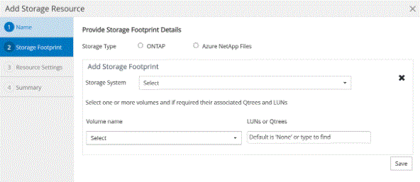

= 將資源新增至SnapCenter 「支援自訂外掛程式」
:allow-uri-read: 
:icons: font
:imagesdir: ../media/

[role="lead"]
您必須新增要備份或複製的資源。視您的環境而定、資源可能是您要備份或複製的資料庫執行個體或集合。

*您需要的是什麼*

* 您必須已完成安裝SnapCenter 完「支援服務器」、新增主機、建立儲存系統連線、以及新增認證等工作。
* 您必須已建立自訂外掛程式。
+
link:concept_develop_a_plug_in_for_your_application.html["為應用程式開發外掛程式"]

* 您必須已將外掛程式上傳至SnapCenter 更新伺服器。

*關於此工作*

您也可以新增MySQL和DB2應用程式的資源。這些外掛程式可從下載 https://["NetApp儲存自動化商店"]。

*步驟*

. 在左導覽窗格中、按一下*資源*、然後從清單中選取適當的外掛程式。
. 在「資源」頁面中、按一下「*新增資源*」。
. 在「提供資源詳細資料」頁面中、執行下列動作：
+
|===
| 針對此欄位... | 執行此動作... 

 a| 
名稱
 a| 
輸入資源名稱。

 a| 
主機名稱
 a| 
選取主機。

 a| 
類型
 a| 
選取類型。類型是根據外掛程式說明檔案所定義的使用者定義。例如、資料庫和執行個體。

如果選取的類型有父項目、請輸入父項目的詳細資料。例如、如果類型是「資料庫」、而父類型是「執行個體」、請輸入執行個體的詳細資料。

 a| 
認證名稱
 a| 
選取「認證」或建立新的認證資料。

 a| 
掛載路徑
 a| 
輸入掛載資源的掛載路徑。這僅適用於Windows主機。

|===
. 在「提供儲存設備佔用空間」頁面中、選取儲存系統、然後選擇一或多個磁碟區、LUN和qtree、然後按一下「*儲存*」。
+
選用：按一下 image:../media/add_policy_from_resourcegroup.gif[""] 圖示、可從其他儲存系統新增更多磁碟區、LUN及qtree。

+

NOTE: 不支援自動探索實體和虛擬環境的資源和儲存詳細資料、而支援使用「自訂外掛程式」SnapCenter 。您必須在建立資源的同時、提供實體和虛擬環境的儲存資訊。

+

. 在「資源設定」頁面中、提供資源的自訂金鑰值配對。
+
如果您要傳遞資源特定資訊、請使用自訂金鑰值配對。例如、當您使用MySQL外掛程式時、必須將主機指定為主機名稱、連接埠=port-no用於MySQL、而master_slave組態指定為「'Yes」或「'no'」（名稱為master_slave、值為「'Yes」或「'no'」）。

+

NOTE: 請確定主機和連接埠的文字為大寫。

+
image::../media/resource_settings.gif[資源設定]

. 檢閱摘要、然後按一下「*完成*」。

* 結果 *

這些資源會連同類型、主機或叢集名稱、相關資源群組和原則、以及整體狀態等資訊一起顯示。

IMPORTANT: 如果資料庫重新命名為SnapCenter 不屬於支援範圍、您必須重新整理資源。

*完成後*

如果您想讓其他使用者存取資產、SnapCenter 則該管理員必須將資產指派給這些使用者。如此一來、使用者就能對指派給他們的資產執行其擁有權限的動作。

新增資源之後、您可以修改資源詳細資料。如果自訂外掛程式資源有與其相關的備份、則無法修改下列欄位：資源名稱、資源類型和主機名稱。
