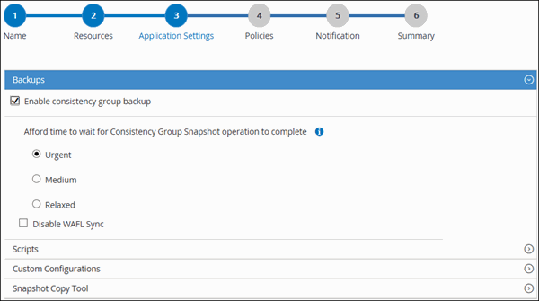

= 備份個別的自訂外掛程式資源
:allow-uri-read: 
:icons: font
:imagesdir: ../media/

[role="lead"]
如果個別的自訂外掛程式資源不是任何資源群組的一部分、您可以從「資源」頁面備份資源。您可以隨需備份資源、或者、如果資源已附加原則並已設定排程、則會根據排程自動進行備份。

.開始之前
* 您必須已建立備份原則。
* 如果您想要備份與二線儲存設備有SnapMirror關係的資源、ONTAP 指派給儲存設備使用者的這個角色應該包含「全部快照鏡射」權限。不過、如果您使用「vsadmin」角色、則不需要「全部快照鏡像」權限。

.步驟
. 在左導覽窗格中、按一下*資源*、然後從清單中選取適當的外掛程式。
. 在「資源」頁面中、根據資源類型篩選*檢視*下拉式清單中的資源。
+
按一下 image:../media/filter_icon.png[""]，然後選取主機名稱和資源類型以篩選資源。然後按一下 image:../media/filter_icon.png["篩選圖示"] 以關閉篩選窗格。

. 按一下您要備份的資源。
. 在「資源」頁面中、如果您想要使用自訂名稱、請選取「*使用Snapshot COP*的自訂名稱格式」核取方塊、然後輸入Snapshot複本名稱的自訂名稱格式。
+
例如、_customtext_policy_hostname_或_resource_hostname_。根據預設、快照複本名稱會附加時間戳記。

. 在「應用程式設定」頁面中、執行下列動作：
+
.. 按一下*備份*箭頭以設定其他備份選項：
+
視需要啟用一致性群組備份、並執行下列工作：

+
|===
| 針對此欄位... | 執行此動作... 

 a| 
等待一致性群組快照作業完成的時間
 a| 
選取「緊急」、「中」或「輕鬆」、以指定完成Snapshot複本作業的等待時間。

「緊急」= 5秒、「中」= 7秒、「輕鬆」= 20秒。

 a| 
停用WAFL Sync
 a| 
選擇此選項可避免強制WAFL 使用不一致點。

|===
+

.. 按一下「*指令碼*」箭頭以執行「靜止」、「Snapshot複本」和「靜止」作業的「預先」和「POST」命令。您也可以在結束備份作業之前執行pres命令。
+
指令碼和指令碼會在SnapCenter 支援服務器上執行。

.. 按一下「*自訂組態*」箭頭、然後輸入使用此資源之所有工作所需的自訂值配對。
.. 按一下「* Snapshot Copy Tool*（* Snapshot複製工具*）」箭頭、選取建立Snapshot複本的工具：
+
|===
| 如果您需要... | 然後... 

 a| 
執行儲存層級Snapshot複本SnapCenter
 a| 
選擇* SnapCenter 不含檔案系統一致性*的功能。

 a| 
使用Windows外掛程式將檔案系統置於一致狀態、然後製作Snapshot複本SnapCenter
 a| 
選擇* SnapCenter 《以檔案系統一致性*》。

 a| 
可輸入命令以建立Snapshot複本
 a| 
選取*其他*、然後輸入命令以建立Snapshot複本。

|===

. 在「原則」頁面中、執行下列步驟：
+
.. 從下拉式清單中選取一或多個原則。
+

NOTE: 您也可以按一下建立原則 image:../media/add_policy_from_resourcegroup.gif["新增圖示"]。

+
在「設定所選原則的排程」區段中、會列出所選原則。

.. 按一下 image:../media/add_policy_from_resourcegroup.gif["新增圖示"] 在您要為其設定排程的原則之「設定排程」欄中。
.. 在「新增原則_policy_name_的排程」對話方塊中、設定排程、然後按一下「*確定*」。
+
其中、_policy_name_是您選取的原則名稱。

+
已設定的排程會列在「已套用的排程」欄中。

. 在「通知」頁面的*電子郵件喜好設定*下拉式清單中、選取您要傳送電子郵件的案例。
+
您也必須指定寄件者和接收者的電子郵件地址、以及電子郵件的主旨。也必須在*設定*>*全域設定*中設定SMTP。

. 檢閱摘要、然後按一下「*完成*」。
+
此時會顯示「資源拓撲」頁面。

. 按一下*立即備份*。
. 在「備份」頁面中、執行下列步驟：
+
.. 如果您已將多個原則套用至資源、請從* Policy*下拉式清單中選取要用於備份的原則。
+
如果針對隨需備份所選取的原則與備份排程相關聯、則會根據為排程類型指定的保留設定來保留隨需備份。

.. 按一下*備份*。

. 按一下*監控*>*工作*來監控作業進度。

