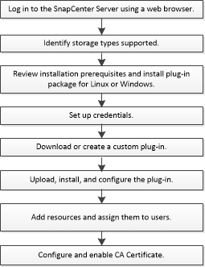

= 安裝流程：不需安裝程式SnapCenter
:allow-uri-read: 
:icons: font
:imagesdir: ../media/

[role="lead"]
如果您想要保護自訂外掛程式資源、請安裝並設定SnapCenter 「支援」功能。

link:concept_develop_a_plug_in_for_your_application.html["為應用程式開發外掛程式"]
