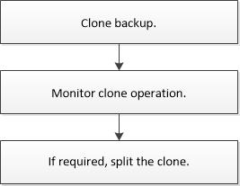

= 複製工作流程
:allow-uri-read: 
:icons: font
:imagesdir: ../media/

[role="lead"]
複製工作流程包括規劃、執行複製作業及監控作業。

您可能會因為下列原因而複製資料庫：

* 在應用程式開發週期期間、測試必須使用目前資料庫結構和內容來實作的功能。
* 使用資料擷取和處理工具來填入資料倉儲。
* 以恢復錯誤刪除或變更的資料。

下列工作流程顯示您必須執行複製作業的順序：

