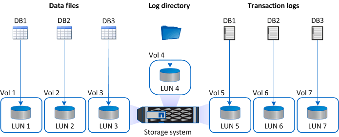

= 針對Microsoft SQL Server的解決方案、提供儲存配置建議SnapCenter
:allow-uri-read: 
:icons: font
:imagesdir: ../media/

[role="lead"]
設計完善的儲存配置可讓SnapCenter 支援服務器備份資料庫、以符合您的恢復目標。在定義儲存配置時、您應該考量幾個因素、包括資料庫大小、資料庫變更率、以及執行備份的頻率。

下列各節定義使用SnapCenter 安裝在環境中的Microsoft SQL Server適用的VMware Plug-in之LUN和虛擬機器磁碟（VMDK）的儲存配置建議和限制。

在這種情況下、LUN可以包含VMware RDM磁碟和對應至客體的iSCSI直接附加LUN。

== LUN與VMDK需求

您可以選擇使用專屬的LUN或VMDK、為下列資料庫提供最佳效能與管理：

* 主要和模型系統資料庫
* 範本
* 使用者資料庫檔案（.mdf和.NDF）
* 使用者資料庫交易記錄檔（.ldf）
* 記錄目錄

若要還原大型資料庫、最佳做法是使用專屬的LUN或VMDK。還原完整LUN或VMDK所需的時間、少於還原LUN或VMDK中儲存的個別檔案所需的時間。

對於記錄目錄、您應該建立獨立的LUN或VMDK、以便在資料或記錄檔磁碟中有足夠的可用空間。

== LUN和VMDK範例配置

下圖顯示如何設定LUN上大型資料庫的儲存配置：

下圖顯示如何在LUN上設定中型或小型資料庫的儲存配置：

image::../media/smsql_storage_layout_mult_dbs_luns_snapcenter.gif[每個LUN的多個資料庫圖表]

下圖顯示如何在VMDK上設定大型資料庫的儲存配置：

image::../media/smsql_storage_layout_large_dbs_vmdk.gif[VMDK大型資料庫的儲存配置]

下圖顯示如何在VMDK上設定中型或小型資料庫的儲存配置：

image::../media/smsql_storage_layout_med_small_dbs_vmdk.gif[VMDK中中型或小型資料庫的儲存配置]
